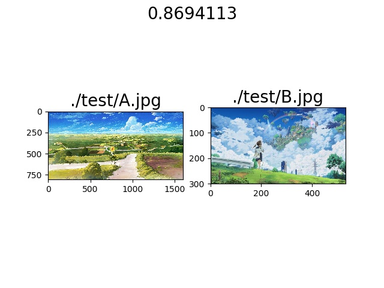
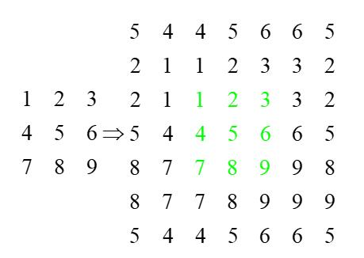
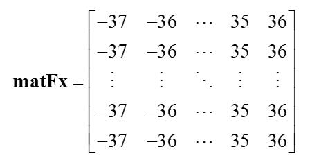
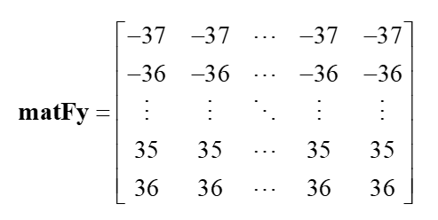
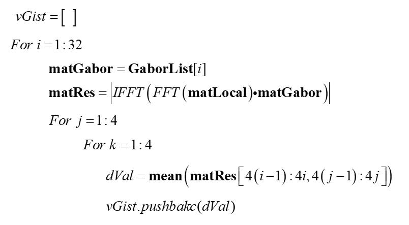
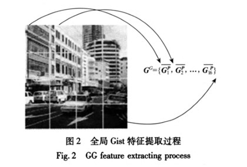

# 1什么是Gist特征

&nbsp;&nbsp;&nbsp;&nbsp;&nbsp;&nbsp;&nbsp;(1) 一种宏观意义的场景特征描述

&nbsp;&nbsp;&nbsp;&nbsp;&nbsp;&nbsp;&nbsp;(2) 只识别“大街上有一些行人”这个场景，无需知道图像中在那些位置有多少人，或者有其他什么对象。

&nbsp;&nbsp;&nbsp;&nbsp;&nbsp;&nbsp;&nbsp;(3) Gist特征向量可以一定程度表征这种宏观场景特征

GIST定义下列五种对空间包络的描述方法

|空间包络名|阐释|
|--|--|
|自然度（Degree of Naturalness）|场景如果包含高度的水平和垂直线，这表明该场景有明显的人工痕迹，通常自然景象具有纹理区域和起伏的轮廓。所以，边缘具有高度垂直于水平倾向的自然度低，反之自然度高。|
|开放度（Degree of Openness）|空间包络是否是封闭（或围绕）的。封闭的，例如：森林、山、城市中心。或者是广阔的，开放的，例如：海岸、高速公路。|
|粗糙度（Degree of Roughness）|主要指主要构成成分的颗粒大小。这取决于每个空间中元素的尺寸，他们构建更加复杂的元素的可能性，以及构建的元素之间的结构关系等等。粗糙度与场景的分形维度有关，所以可以叫复杂度。|
|膨胀度（Degree of Expansion）|平行线收敛，给出了空间梯度的深度特点。例如平面视图中的建筑物，具有低膨胀度。相反，非常长的街道则具有高膨胀度。|
|险峻度（Degree of Ruggedness）|即相对于水平线的偏移。（例如，平坦的水平地面上的山地景观与陡峭的地面）。险峻的环境下在图片中生产倾斜的轮廓，并隐藏了地平线线。大多数的人造环境建立了平坦地面。因此，险峻的环境大多是自然的。|

# 2 Gist的实现--LMgist 

* LMgist的Matlab代码 [LMgist Matlab代码](http://people.csail.mit.edu/torralba/code/spatialenvelope/LMgist.m)

* LMgist Matlab代码的使用

```
% 读取图片
img = imread('demo2.jpg');

% 设置GIST参数
clear param
param.orientationsPerScale = [8 8 8 8]; % number of orientations per scale (from HF to LF)
param.numberBlocks = 4;
param.fc_prefilt = 4;

% 计算GIST
[gist, param] = LMgist(img, '', param);
```

# 3 LMgist的Python实现

# 3.1 提取Gist特征

```
from img_gist_feature.utils_gist import *

s_img_url = "./test/A.jpg"
gist_helper = GistUtils()
np_img = preproc_img(s_img_url)
np_gist = gist_helper.get_gist_vec(np_img)

print(np_gist)

```
运行得到的gist特征为
[[0.08787015 0.07296596 0.10566235 ... 0.03908335 0.03852283 0.03798099]]


# 3.2 Gist特征余弦相似距离

运行python _test_get_cossim.py

<center>
<br>
</center>

<center>
<br>
</center>

# 4 LMgist原理

## 4.1 LMgist算法主流程

* G1:对输入图片进行预处理 (RGB或RGBA转128x128灰度图)

* G2:对输入图片进行Prefilt处理

* G3:计算图片的Gist向量

## 4.2 G2 对输入图片进行Prefilt处理

### 4.2.1 Pad images to reduce boundary artifacts  (扩边+去伪影)

$${\bf{matlog}} = \log \left( {{\bf{mat}} + 1} \right)$$
$${\bf{matPad}} = {\mathop{\rm sympading}\nolimits} \left( {{\bf{matlog}},\left[ {5,5,5,5} \right]} \right)$$

<center>
<br>
图1 sympading操作
</center>

### 4.2.2 Filter  (构造滤波器)

<center>
<br>
</center>

<center>
<br>
</center>


$${\bf{matGf}} = {\mathop{\rm FFTSHITF}\nolimits} \left( {\exp \left( { - \frac{{{\bf{matF}}{{\bf{x}}^2} + {\bf{matF}}{{\bf{y}}^2}}}{{{{\left( {\frac{{fc}}{{\sqrt {\log \left( 2 \right)} }}} \right)}^2}}}} \right)} \right)$$


### 4.2.3 Whitening  (白化)

$${\bf{matRes}} = {\bf{matPad}} - {\mathop{\rm Real}\nolimits} \left( {{\mathop{\rm IFFT}\nolimits} \left( {{\mathop{\rm FFT}\nolimits} \left( {{\bf{matPad}}} \right){\bf{matGf}}} \right)} \right)$$


### 4.2.4 Local contrast normalization (局部对比度归一化）

$${\bf{matLocal}} = \sqrt {\left| {{\mathop{\rm IFFT}\nolimits} \left( {{\mathop{\rm FFT}\nolimits} \left( {{\bf{matRes}} \cdot {\bf{matRes}}} \right) \cdot {\bf{matGf}}} \right)} \right|} $$

$$ {\bf{matRes}} = \frac{{{\bf{matRes}}}}{{0.2 + {\bf{matLocal}}}} $$


### 4.2.5 Local contrast normalization (局部对比度归一化）

$${\bf{matPrefilt = matRes}}\left[ {5:64 + 5,5:64 + 5} \right]$$

## 4.3 计算图片的Gist向量

### 4.3.1 Pading  

$${\bf{matPad}} = {\mathop{\rm sympading}\nolimits} \left( {{\bf{matPrefilt}},\left[ {32,32,32,32} \right]} \right)$$

### 4.3.2 FFT

$${\bf{matLocal}} = {\mathop{\rm FFT}\nolimits} \left( {{\bf{matPad}}} \right)$$

### 4.3.3 遍历每个Gabor核函数

<center>
<br>
</center>

<center>
<br>
图2 全局Gist特征的提取
</center>


# 参考资料

* https://www.cnblogs.com/justany/archive/2012/12/06/2804211.html
* https://blog.csdn.net/qq_16234613/article/details/78909839

